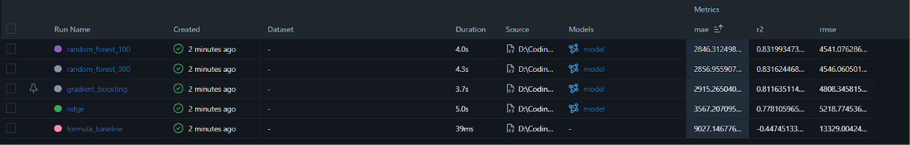
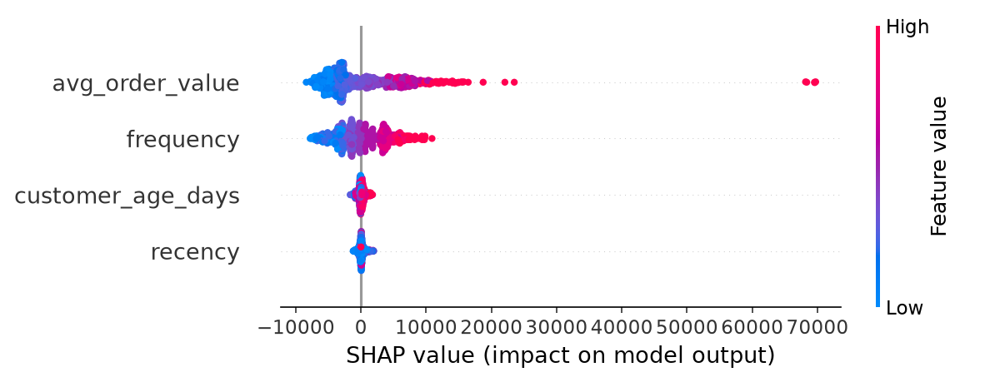
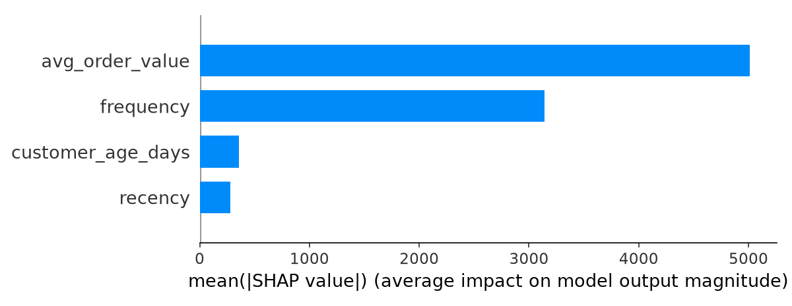

# 🎯 Customer Lifetime Value (CLV) Prediction Platform

[](https://github.com/irlhasnain/clv-prediction-platform/actions/workflows/ci.yml)

An end-to-end machine learning system that predicts customer lifetime value from RFM-style features and serves real-time predictions through a REST API. CLV is defined here as a customer's total historical monetary value.

**🔗 Live API docs:** https://clv-prediction-platform-t672.onrender.com/docs
*(hosted on a free tier, so the first request after idle time can take ~30-60 seconds)*

## 📌 Highlights

- SQL-based feature pipeline (SQLite) feeding a Random Forest model, served with FastAPI
- 5 models benchmarked with **MLflow** on the same train/test split
- Random Forest reduced MAE by **~68% vs. a formula baseline** and **~20% vs. Ridge** (R² = 0.83)
- **CI** with GitHub Actions: lint (ruff), tests (pytest), Docker build
- **Dockerized** and deployed on Render
- **SHAP** explainability and an **Evidently** data-drift report (simulated demo)

## 🏗️ Architecture

```
Raw data → ETL (clean + load) → SQLite DB → SQL feature engineering (RFM)
        → Model training (scikit-learn) → models/clv_model.pkl
        → FastAPI (/predict) → Docker → Render

Side tooling:  MLflow (experiments) · SHAP (explainability) · Evidently (drift)
CI:            GitHub Actions → ruff → pytest → docker build
```

## 📁 Project Structure

```
clv-prediction-platform/
├── .github/workflows/ci.yml   # CI: ruff, pytest, docker build
├── api/                       # FastAPI serving app
├── database/                  # DB connection and schema
├── etl/                       # Data cleaning and loading
├── features/                  # RFM feature engineering
├── models/                    # Training, baseline, MLflow, SHAP
├── monitoring/                # Evidently drift report
├── tests/                     # API tests
├── docs/                      # Plots and reports
├── Dockerfile
├── Procfile
├── requirements.txt           # Runtime dependencies
├── requirements-dev.txt       # Lint and test tools (used in CI)
└── requirements-mlops.txt     # MLflow, SHAP, Evidently (local only)
```

## 🔧 Tech Stack

- **Language:** Python
- **Database:** SQLite
- **ML:** scikit-learn (Random Forest, Ridge, Gradient Boosting)
- **API:** FastAPI, Pydantic, Uvicorn
- **MLOps:** MLflow, SHAP, Evidently, Docker, GitHub Actions
- **Quality:** pytest, httpx, ruff

## 📈 Model Results

Features: `frequency`, `recency`, `customer_age_days`, `avg_order_value`. Target: `monetary` (total customer spend).
793 customers, 80/20 train/test split (test set ≈ 160 customers). All models were evaluated on the same split and tracked in MLflow.

| Model | MAE | RMSE | R² |
|---|---|---|---|
| Formula baseline (`frequency × avg_order_value`) | 9,027 | 13,329 | -0.447 |
| Ridge | 3,567 | 5,219 | 0.778 |
| Gradient Boosting (default params) | 2,915 | 4,808 | 0.812 |
| Random Forest (300 trees, depth 10) | 2,857 | 4,546 | 0.832 |
| **Random Forest (100 trees)** | **2,846** | **4,541** | **0.832** |

- Random Forest cut MAE by ~68% vs. the formula baseline and ~20% vs. Ridge.
- 5-fold cross-validated MAE for Random Forest: **2,958 ± 151**, consistent with the single-split result.
- Going from 100 to 300 trees gave no gain, so the simpler configuration is preferred.
- Gradient Boosting was run with default parameters only (not tuned).



## 🔍 Explainability (SHAP)

Mean absolute SHAP value per feature:

| Feature | Mean \|SHAP\| |
|---|---|
| `avg_order_value` | 5,010 |
| `frequency` | 3,143 |
| `customer_age_days` | 357 |
| `recency` | 281 |

The model relies almost entirely on `avg_order_value` and `frequency`; recency and customer tenure contribute far less.
Since the target (total spend) is naturally tied to order value and purchase count, this ranking is expected.




## 📉 Drift Monitoring (Evidently)

`monitoring/drift_report.py` compares a reference sample against a current sample and writes an HTML report to `docs/drift_report.html` (download the file to view it in a browser).
**Note:** the drift here is simulated for demonstration (order values scaled up and recency increased); it is not drift observed in production.

## 🚀 How to Run Locally

```bash
# Clone and set up
git clone https://github.com/irlhasnain/clv-prediction-platform.git
cd clv-prediction-platform
python -m venv venv
venv\Scripts\activate          # Windows
pip install -r requirements.txt

# Build database, run ETL, build features, train model
python -m database.db_connect
python -m etl.clean_data
python -m etl.load_data
python -m features.build_feature
python -m models.train_model

# Run tests
pip install -r requirements-dev.txt
pytest tests/

# Start the API
uvicorn api.main:app --reload
```

Open `http://127.0.0.1:8000/docs` for interactive API docs.

### Optional: experiments, explainability, drift

```bash
pip install -r requirements-mlops.txt
python -m models.train_mlflow       # compare models, log to MLflow
mlflow ui                           # view runs at http://127.0.0.1:5000
python -m models.explain            # SHAP plots → docs/
python -m monitoring.drift_report   # drift report → docs/
```

### Docker

```bash
docker build -t clv-platform .
docker run -p 8000:8000 clv-platform
```

## 📡 API Usage

**Endpoint:** `POST /predict`

```json
{
  "frequency": 5,
  "recency": 30,
  "customer_age_days": 365,
  "avg_order_value": 150
}
```

Response:

```json
{
  "predicted_clv": 2450.75
}
```

Invalid input (e.g. missing fields) returns `422`.

## ✅ CI

On every pull request, GitHub Actions runs `ruff` (lint), `pytest` (5 API tests) and a Docker build.

## ⚠️ Limitations

- The target is historical spend, not future value. A stricter CLV setup would predict spend over a future window using only earlier data.
- The target is closely related to the input features (order value and frequency), so feature importance should be read as "what the model uses", not causal drivers.
- Small dataset (793 customers): metrics vary with the split, which is why cross-validation is reported.
- Drift report uses simulated drift; the hosted API runs on a free tier with cold starts.

## 📝 License

This project is licensed under the MIT License.